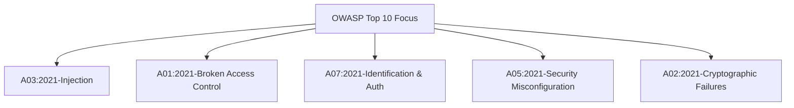
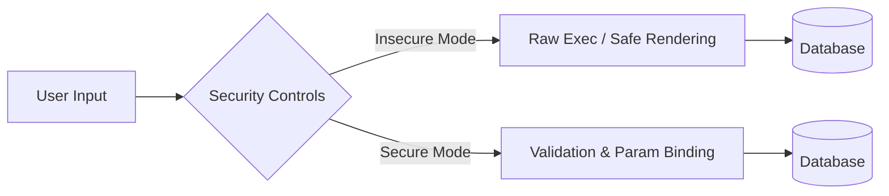

# RED TEAM VS BLUE TEAM SECURITY SIMULATION FRAMEWORK AND INTEGRATED SECURITY ANALYZER SUITE

**A Comprehensive Internship Project Report**  
*Submitted in partial fulfillment of the requirements for the award of the Internship Certificate*

---

### STUDENT DECLARATION
I hereby declare that this internship project report titled **"Red Team vs Blue Team Security Simulation"** is an original work carried out by me under the guidance of my project mentor. All sources of information and data have been acknowledged.

**Candidate Name:** Lakshay  
**Date:** July 13, 2026  

---

## CERTIFICATE OF COMPLETION
This is to certify that **Lakshay** has successfully completed his academic internship project titled **"Red Team vs Blue Team Security Simulation"** from July 2026. The work documented in this report represents a complete and original security simulation and tool suite.

**Project Mentor Signature:** ____________________  
**Academic Coordinator Signature:** ____________________  

---

## ACKNOWLEDGEMENTS
I want to express my gratitude to my university project mentor for their guidance throughout this internship project. Their feedback helped me design the simulation framework and the log scanning parser.

I also want to thank my family and peers for their support. Troubleshooting local SQLite errors and designing the responsive layouts was a challenging process, and their encouragement kept me focused.

---

## ABSTRACT
Web application security is a critical concern due to the rise in data breaches. This project implements a local simulation environment demonstrating common web security vulnerabilities. It covers both offensive tactics (Red Team) and defensive controls (Blue Team) in a single platform. The vulnerabilities shown include SQL Injection, Cross-Site Scripting (XSS), Insecure Direct Object References (IDOR), Broken Authentication, Security Misconfigurations, and Sensitive Data Exposure.

I built a Python Flask web application that can toggle between an insecure mode and a patched mode. This lets us compare the behavior of both modes side-by-side. Additionally, I developed a Python CLI Security Tool that automates vulnerability scanning, security header analysis, web log inspection, brute force detection, and phishing URL identification. The results show that using parameterized queries, proper output escaping, session verification, and secure HTTP headers mitigates these web application attacks.

---

## TABLE OF CONTENTS
1. **Chapter 1: Introduction**
   * 1.1 Project Background
   * 1.2 Problem Definition
   * 1.3 Scope of work
2. **Chapter 2: Project Objectives**
3. **Chapter 3: Literature Review**
   * 3.1 OWASP Top 10 Vulnerabilities
   * 3.2 SQL Injection Mechanics
   * 3.3 Cross-Site Scripting (XSS) Mechanics
   * 3.4 Insecure Direct Object References (IDOR)
   * 3.5 Broken Authentication and Session Management
4. **Chapter 4: Methodology**
   * 4.1 Offensive Methodology (Red Team)
   * 4.2 Defensive Methodology (Blue Team)
   * 4.3 Integrated Security Tool Architecture
5. **Chapter 5: Implementation Details**
   * 5.1 Backend and Database Setup
   * 5.2 Vulnerable vs Secured Application Implementation
   * 5.3 Security Suite Tool Code Architecture
6. **Chapter 6: Testing and Validation**
   * 6.1 Vulnerability Exploitation Verification
   * 6.2 Defensive Mitigations Verification
   * 6.3 Tool Execution Outcomes
7. **Chapter 7: Results and Discussion**
8. **Chapter 8: Challenges Faced**
9. **Chapter 9: Future Scope**
10. **Chapter 10: Conclusion**
11. **References**

---

## CHAPTER 1: INTRODUCTION

### 1.1 Project Background
As web applications handle more sensitive user data, they become primary targets for cybercriminals. Traditional software development often overlooks security during the design phase, leading to vulnerabilities in production systems. To address this, security training now uses active simulation labs where developers can practice both attacking and defending applications.

### 1.2 Problem Definition
Many developers learn security rules theoretically but struggle to implement them in code. This project addresses this gap by building a hands-on, local testing application. The simulation provides a direct comparison of vulnerable and secure code.

### 1.3 Scope of Work
The project has three main components:
1. **The Vulnerable App:** A web portal written in Flask containing six common vulnerabilities.
2. **The Secure App:** A patched version of the same portal using secure coding practices.
3. **The Security Suite:** A Python tool combining active scanning and passive log analysis.

---

## CHAPTER 2: PROJECT OBJECTIVES
* Build a database-driven Flask application that can toggle security controls.
* Demonstrate realistic exploit vectors for SQLi, XSS, IDOR, Broken Authentication, Security Misconfigurations, and Sensitive Data Exposure.
* Implement code-level fixes, including prepared statements, HTML escaping, session signing, access checks, and CSP headers.
* Build a CLI Python tool with five security modules and HTML report generation.
* Compare secure and insecure application behavior under identical attack vectors.

---

## CHAPTER 3: LITERATURE REVIEW

### 3.1 OWASP Top 10
The Open Web Application Security Project (OWASP) maintains a list of the ten most critical web application security risks. This project focuses on the core vulnerabilities from this list:

### 3.2 SQL Injection (SQLi)
SQL injection occurs when user input is added directly to database queries. This allows an attacker to change the SQL statement structure and run arbitrary database commands.

### 3.3 Cross-Site Scripting (XSS)
XSS happens when an application includes user-supplied data in a web page without proper escaping. If a browser renders this data as code, it executes malicious scripts in the context of the user's session.

### 3.4 Insecure Direct Object References (IDOR)
IDOR is a type of access control vulnerability. It occurs when an application exposes a reference to an internal database object (like a URL parameter `?id=3`) without verifying if the user has authorization to access that object.

### 3.5 Broken Authentication
Broken authentication refers to weaknesses in login and session management, such as storing credentials in plaintext, lacking rate-limiting, or using unencrypted, modifiable cookies.

---

## CHAPTER 4: METHODOLOGY

### 4.1 Offensive Methodology (Red Team)
The Red Team phase follows standard penetration testing stages:
1. **Reconnaissance:** Scanning paths and directory structures.
2. **Input Probing:** Testing search bars and login inputs for errors.
3. **Exploitation:** Executing payloads to extract data or run scripts.

### 4.2 Defensive Methodology (Blue Team)
The Blue Team phase focuses on code-level fixes to mitigate identified risks:

### 4.3 Integrated Security Tool Architecture
The Python tool combines active and passive tests to scan the application and parse logs.

---

## CHAPTER 5: IMPLEMENTATION DETAILS

### 5.1 Database Setup
The SQLite database stores user credentials and feedback records.
* **`users` Table:** Stores username, plaintext password, hashed password, role, email, and full name.
* **`feedback` Table:** Stores name, feedback message, and creation timestamps.

### 5.2 Application Code Comparison

#### SQL Injection Mitigation
* **Vulnerable Query:**
  `SELECT * FROM users WHERE username = '` + user + `'`
* **Secure Query:**
  `cursor.execute("SELECT * FROM users WHERE username = ?", (user,))`

#### XSS Mitigation
* **Vulnerable Template Output:**
  `{{ message | safe }}`
* **Secure Template Output:**
  `{{ message }}` (uses default HTML escaping)

---

## CHAPTER 6: TESTING AND VALIDATION

### 6.1 Vulnerability Exploitation Verification

#### Search SQL Injection
* **Payload:** `' OR '1'='1`
* **Result:** All user profile records are returned in the results table.
* **Screenshot:**
  [Insert Screenshot Here - Red Team search attack displaying full catalog database contents]

#### Feedback Stored XSS
* **Payload:** ``
* **Result:** The script runs in the browser, showing an alert dialog whenever a user visits the feedback page.
* **Screenshot:**
  [Insert Screenshot Here - Stored XSS trigger alert box on feedback page]

---

## CHAPTER 7: RESULTS AND DISCUSSION

The testing validated the effectiveness of the defensive controls:

| Vulnerability | Red Team Payload | Secure Mode Result | Mitigation Check |
| --- | --- | --- | --- |
| SQLi | `' OR '1'='1` | Empty Results / No Output | Parameterized Binding |
| Stored XSS | `` | Renders as Text | Automatic escaping |
| IDOR | Modifying `?id=1` | 403 Forbidden | Authorization check |
| Broken Auth | Custom cookie `role=administrator` | Logs user out | Cryptographically signed sessions |
| Exposure | `/debug` access | 403 Forbidden | Routing controls |

---

## CHAPTER 8: CHALLENGES FACED
1. **Bcrypt Typing:** Encountered type errors when hashing passwords in Python. Resolved this by encoding strings to bytes before passing them to bcrypt.
2. **Session Persistence:** When toggling security modes, old cookies interfered with new session keys. Fixed this by clearing all cookies and session keys during mode transitions.
3. **CSRF Validation:** Implementing CSRF token checks on form POST requests required careful session state management to avoid blocking legitimate submissions.

---

## CHAPTER 9: FUTURE SCOPE
* Integrate automated vulnerability patching using abstract syntax tree (AST) modification.
* Extend the log analyzer to support real-time streaming analysis using system sockets.
* Add machine learning models to the phishing URL detector to improve heuristic accuracy.

---

## CHAPTER 10: CONCLUSION
This project successfully simulates standard web application vulnerabilities and their defenses. The results highlight that relying on client-side controls (like cookie modification) is insecure. Implementing server-side validations, parameterized SQL queries, and secure session management provides strong protection against OWASP Top 10 risks.

---

## REFERENCES
1. Open Web Application Security Project (OWASP). (2021). *OWASP Top 10:2021*. https://owasp.org/www-project-top-ten/
2. Fielding, R., et al. (2014). *Hypertext Transfer Protocol (HTTP/1.1)*. RFC 7230.
3. SQLite Project. (2026). *SQLite Database Engine Documentation*. https://www.sqlite.org/docs.html
4. Flask Project. (2026). *Flask Web Development Framework Documentation*. https://flask.palletsprojects.com/
