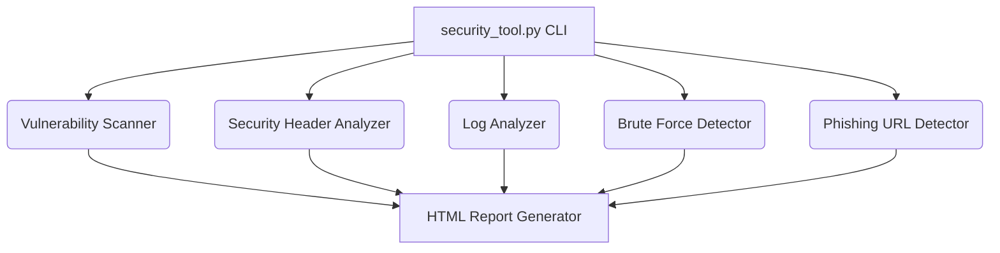

# Integrated Security Suite Tool Documentation

## 1. Architecture
The Integrated Security Suite is a modular Python CLI tool designed to perform active scanning and passive security logs analysis. The tool utilizes standard libraries (`re`, `json`, `urllib`) and the `requests` library to interface with target websites. It is structured to run independently from the command line, requiring zero configurations.



---

## 2. Workflow
The suite operates by running each module sequentially against defined targets:
1. **Payload Load:** Loads test injection scripts from `payloads.json`.
2. **Active Testing:** Runs web request probes to check for exposed files and injection flaws.
3. **Response Headers Analysis:** Checks HTTP response headers and computes a security score.
4. **Log Diagnostics:** Scans server log files for attack signatures and brute-force traffic.
5. **Heuristic Check:** Evaluates target URL names for phishing signs.
6. **Reporting:** Combines all findings into a clean HTML file.

---

## 3. Modules

### Module A: Vulnerability Scanner
* **Purpose:** Probes web servers for common entry point vulnerabilities.
* **Technique:**
  * Appends paths like `.env` or database files to the target URL to check for exposure.
  * Injects SQL payloads into parameters and checks for SQLite driver database errors in responses.
  * Inserts script tags into search queries and checks if the output is returned without escaping.

### Module B: Security Header Analyzer
* **Purpose:** Evaluates defensive security headers in HTTP responses.
* **Technique:** Inspects headers like `Content-Security-Policy` and `Strict-Transport-Security`, calculates a score, and recommends fixes for missing headers.

### Module C: Log Analyzer
* **Purpose:** Scans server access logs for attack attempts.
* **Technique:** Reads log files line-by-line, matching substrings against regular expressions for SQLi, XSS, and directory traversal.

### Module D: Brute Force Detector
* **Purpose:** Flags login brute-force attacks.
* **Technique:** Filters `POST /login` events. If the failed attempt count from a single IP exceeds a limit, it flags the IP as high risk.

### Module E: Phishing URL Detector
* **Purpose:** Checks if a URL is suspicious.
* **Technique:** Inspects the URL string for phishing indicators like missing HTTPS, IP hostnames, excessive length, subdomain count, and suspicious keywords.

---

## 4. Installation
Install the required packages using pip:
```bash
pip install -r requirements.txt
```

---

## 5. Usage
To run the full suite:
```bash
python scanner/security_tool.py
```

---

## 6. Examples & Outputs

### Terminal Console Output Example:
```text
==================================================
    Red Team & Blue Team Security Suite Tool
==================================================

=== [1] Active Vulnerability Scanner ===
[*] Probing exposed files on http://127.0.0.1:5000/...
  [!] EXPOSED FILE FOUND: http://127.0.0.1:5000/.env
[*] Scanning SQL Injection on search forms...
  [!] SQLi Vulnerability detected with payload: ' OR '1'='1
[*] Scanning Reflected XSS on search endpoints...
  [!] XSS Vulnerability detected with payload: <script>alert(1)</script>

=== [2] Security Headers Analyzer ===
  [-] MISSING: Content-Security-Policy
  [-] MISSING: Strict-Transport-Security
  [+] X-Frame-Options: DENY
  [+] X-Content-Type-Options: nosniff
  [+] X-XSS-Protection: 1; mode=block

[*] Total Security Headers Score: 60/100

=== [3] Log Analyzer ===
[*] Analysis Summary for: scanner/sample_logs.txt
  SQLi Attempts flagged: 1
  XSS Attempts flagged: 1
  Directory Traversal flagged: 1

=== [4] Brute Force Detector ===
  [!] WARNING: IP 192.168.1.45 flagged with 6 failed login attempts!

=== [5] Phishing URL Detector ===
[*] URL: http://192.168.1.1/secure-update/login.php?user=admin
  Phishing Score Index: 75/100
  [!] STATUS: Suspicious URL detected!
    - Missing HTTPS protocol
    - Hostname is an IP address
    - Contains suspicious keyword: login

[+] Comprehensive Report generated at: reports/security_analysis_report.html
```

---

## 7. Future Improvements
* Add multi-threading to speed up active URL scanning.
* Connect to external reputation services to improve phishing URL detection.
* Support custom log formats using configurable regex strings.
